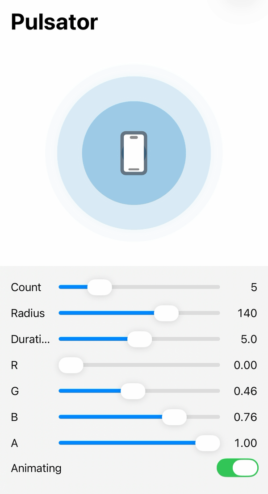

Pulsator
===========

[](http://mit-license.org)
[-@shu223-black.svg?style=flat)](https://x.com/shu223)

Pulse animation for iOS and macOS, usable from both UIKit and SwiftUI.

<p align="center">
  
</p>
                    
Great For:

- **Pulses of Bluetooth, BLE, beacons (iBeacon)**, etc.
- Map Annotations

## Installation

### Swift Package Manager

In Xcode, choose **File → Add Package Dependencies…** and enter the repository URL:

```
https://github.com/shu223/Pulsator
```

Or add it to the `dependencies` of your `Package.swift`:

```swift
.package(url: "https://github.com/shu223/Pulsator.git", from: "0.7.0")
```

### CocoaPods

Add into your Podfile.

```:Podfile
pod "Pulsator"
```

Then `$ pod install`


## How to use

### UIKit

Just **3 lines**!

Initiate and add to your view's layer, then call `start`!

```swift
let pulsator = Pulsator()
view.layer.addSublayer(pulsator)
pulsator.start()
```

### SwiftUI

Use `PulsatorView`. Give it a frame large enough for the pulse, since the pulse expands beyond the view's own bounds.

```swift
import SwiftUI
import Pulsator

struct ContentView: View {
    var body: some View {
        PulsatorView()
            .frame(width: 160, height: 160)
    }
}
```


## Customizations

### Number of Pulses

Use `numPulse` property.

```swift
pulsator.numPulse = 3
```

### Radius

Use `radius` property.

```swift
pulsator.radius = 240.0
```

### Color

Just set the `backgroundColor` property.

```swift
pulsator.backgroundColor = UIColor(red: 1, green: 1, blue: 0, alpha: 1).cgColor
```

### Animation Duration

Use following properties

- `animationDuration` : duration for each pulse
- `pulseInterval` : interval between pulses

### Easing

You can set the `timingFunction` property.


### Repeat

Use `repeatCount` property.


## Demo

Try changing the `radius`, `backgroundColor` or other properties with the demo apps.

- UIKit: `Example/UIKit/PulsatorDemo.xcodeproj`
- SwiftUI: `Example/SwiftUI/PulsatorDemo.xcodeproj`


## macOS support

Add into your Podfile, then run `pod install`.

```:Podfile
platform :osx, '10.9'

target 'Pulsator' do
  use_frameworks!
  pod "Pulsator"
end
```

The usage is same as iOS.

```swift
let pulsator = Pulsator()
view.layer?.addSublayer(pulsator)
pulsator.start()
```

## Objective-C version

There is an ObjC version, but it's not maintained now.

- https://github.com/shu223/PulsingHalo

You can use Pulsator also with Objective-C.

```
#import "Pulsator-Swift.h"
```


## Author

**Shuichi Tsutsumi**

iOS freelancer in Japan. Welcome works from abroad!

<a href="https://paypal.me/shu223">
  
</a>

- PAST WORKS:  [My Profile Summary](https://medium.com/@shu223/my-profile-summary-f14bfc1e7099#.vdh0i7clr)
- PROFILES: [LinkedIn](https://www.linkedin.com/in/shuichi-tsutsumi-525b755b/)
- BLOG: [English](https://medium.com/@shu223/) / [Japanese](http://d.hatena.ne.jp/shu223/)
- CONTACTS:
  - [X](https://x.com/shu223)
  - [Facebook](https://www.facebook.com/shuichi.tsutsumi)
